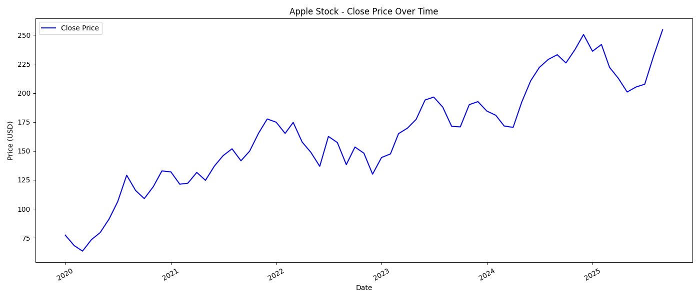
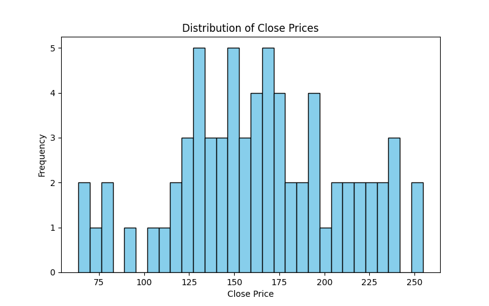
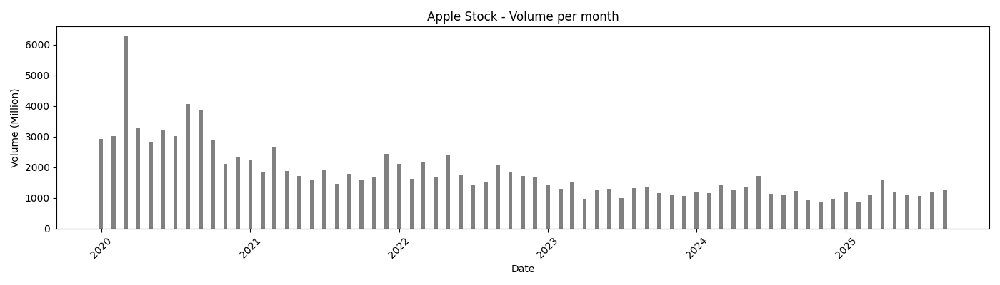
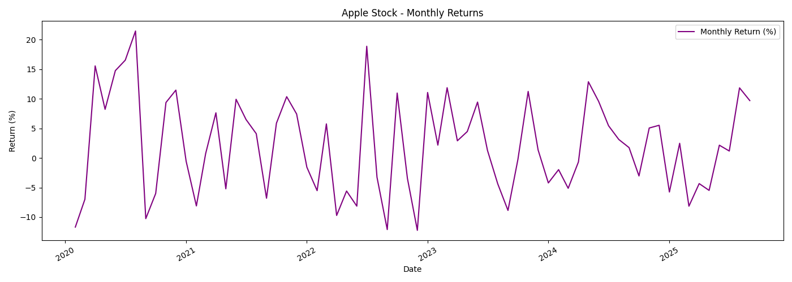
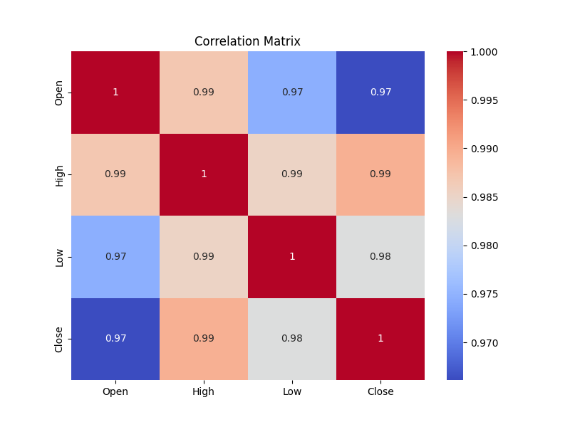
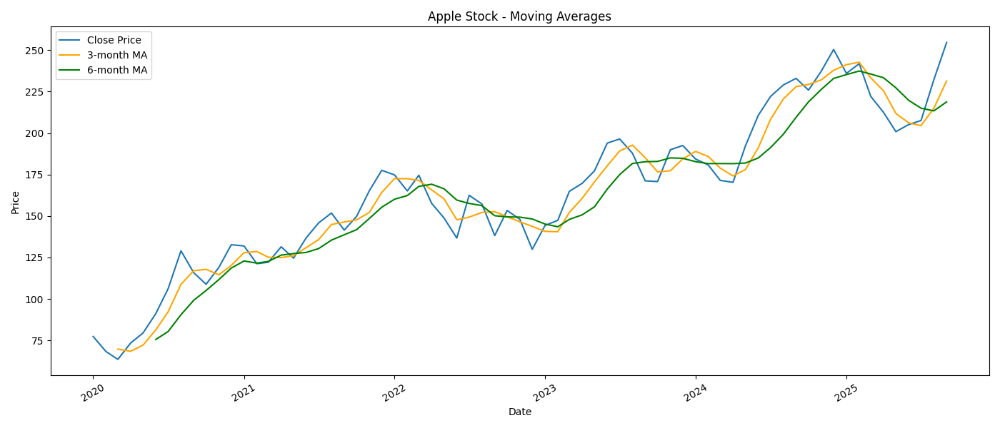
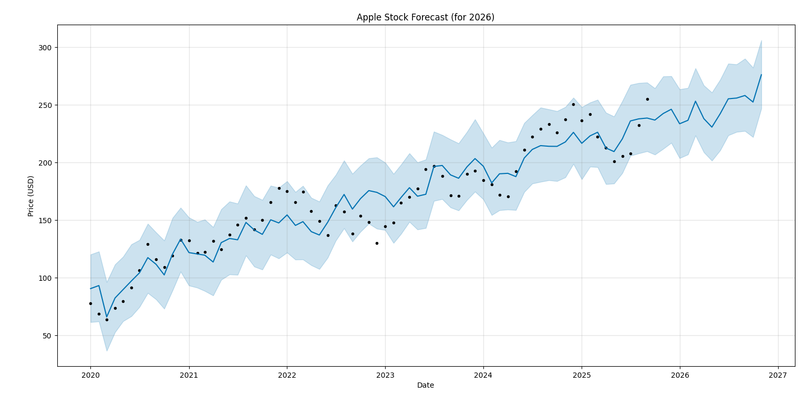
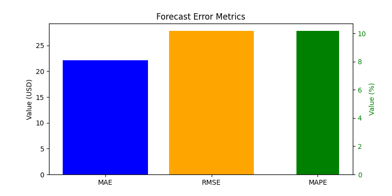

# 📊 Apple Stock Analysis & Forecast
This project provides an in-depth analysis of **Apple Inc. (AAPL)** stock performance from 2020 to 2025, using real monthly data.  
The analysis explores **price trends, trading volume, returns, correlations, and moving averages**, and concludes with a **forecast for 2026** using the **Facebook Prophet** model.  
The goal is to visualize and interpret Apple’s stock evolution over time and to understand possible future price movements through data-driven insights.

---

## 1️⃣ Apple Stock Close Price Over Time
This line chart shows the evolution of Apple’s *Close Price* from 2020 to 2025.
We can clearly see an upward long-term trend, with a major **drop in early 2020** during the COVID-19 crisis, followed by a strong recovery and consistent growth. The highest peak corresponds to the most recent months, highlighting Apple’s continued market strength.

---

## 2️⃣ Distribution of Close Prices
This histogram visualizes the frequency distribution of Apple’s closing prices over the entire period.
The most frequent values are concentrated **between approximately 125 and 175 USD**, indicating that Apple’s stock price has spent most of its time in this range over the past five years.

---

## 3️⃣ Apple Stock Volume per Month (in Millions)
This bar chart shows Apple’s *trading volume* (in millions) for each month from 2020 to 2025.
At the beginning of 2020, we observe **extremely high trading volumes**, exceeding **6,000 million (≈6 billion)**, likely influenced by strong market volatility.
From 2022–2023 onward, trading activity becomes more stable, with monthly volumes remaining around **1 billion**, showing a normalization in trading intensity.

---

## 4️⃣ Apple Stock Monthly Return (%)
This chart illustrates the *monthly return rate* of Apple’s stock, expressed as a percentage.
The curve shows strong **fluctuations**, alternating between positive and negative spikes.
This highlights the **volatility and cyclical nature** of the stock’s performance — typical for large-cap technology companies reacting to quarterly earnings and market news.

---

## 5️⃣ Correlation Matrix
The correlation heatmap shows the relationships between **Open, High, Low, and Close** prices.
The OHLC values are **highly correlated (0.97–0.99)**, which is expected since they all describe different aspects of the same stock price behavior.

---

## 6️⃣ Apple Stock Moving Averages (3-Month and 6-Month)
This plot compares the *Close Price* (blue) with its **3-month moving average** (orange) and **6-month moving average** (green).
The moving averages smooth out short-term fluctuations and highlight medium-term trends.
The 3-month MA reacts more quickly to price changes, while the 6-month MA provides a broader view of the underlying trend.
Despite small deviations, all lines generally follow the same upward trajectory — indicating a **consistent long-term growth pattern**.

---

## 7️⃣ Apple Stock Forecast for 2026 (Prophet Model)
This forecast plot, generated with the **Facebook Prophet** model, extends the Close Price trend into **2026**.
The shaded area represents the **95% confidence interval**, showing the uncertainty around future predictions.
According to the model, Apple’s stock is expected to **continue increasing moderately**, maintaining a positive long-term outlook.

---

## 8️⃣ Forecast Error Metrics
This final chart displays the **evaluation metrics** used to assess the model’s forecasting accuracy:
- **MAE (Mean Absolute Error):** 22.14 USD
- **RMSE (Root Mean Square Error):** 27.87 USD
- **MAPE (Mean Absolute Percentage Error):** 10.20%

The first two are expressed in USD, while the last one is a percentage.
These values indicate a **good predictive performance**, with an average error around 10%, which is acceptable for stock market forecasting.

---

## 🧠 Tools and Technologies Used
This entire analysis was carried out using **Python**, leveraging the following key libraries:
- **Pandas** and **NumPy** for data processing and transformation
- **Matplotlib** and **Seaborn** for data visualization
- **Prophet** for time series forecasting
- **Scikit-learn** for model evaluation metrics
